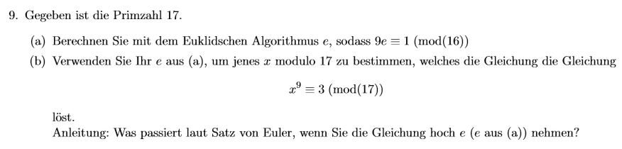

## Aufgabe 9 – Inverse und Potenzierung mit dem Satz von Euler

Gegeben ist die Primzahl **17**

---

### (a) Berechnen Sie mit dem Euklidischen Algorithmus ein e, sodass gilt:

    9·e ≡ 1 mod 16

Ziel: Finde das **multiplikative Inverse von 9 modulo 16**.

Das bedeutet:  
Wir suchen eine Zahl **e**, sodass:

    ggT(9, 16) = 1   ✅ (weil 9 und 16 teilerfremd sind)  
    9·e ≡ 1 mod 16

#### Erweiterter Euklidischer Algorithmus

Wir lösen die Gleichung:

    9·e + 16·k = 1

**Schrittweise:**

```

16 = 1·9 + 7
9 = 1·7 + 2
7 = 3·2 + 1
2 = 2·1 + 0

```

Der ggT(9, 16) = 1 ✅

Jetzt rückwärts einsetzen:

1 = 7 − 3·2  
  = 7 − 3·(9 − 1·7)  
  = 4·7 − 3·9  
  = 4·(16 − 1·9) − 3·9  
  = 4·16 − 4·9 − 3·9  
  = 4·16 − 7·9

Daraus folgt:

    1 = 4·16 − 7·9  
⇒  −7·9 ≡ 1 mod 16  
⇒  e = −7 ≡ 9 mod 16

✅ Ergebnis: **e = 9**

---

### (b) Verwenden Sie das e aus (a), um jene Zahl x ∈ ℤ₁₇ zu bestimmen, die:

    x⁹ ≡ 3 mod 17

---

#### 🎯 Ziel:

Löse die Kongruenz:

    x⁹ ≡ 3 mod 17

---

### 📌 Idee (laut Anleitung):

**Was passiert**, wenn man beide Seiten der Gleichung hoch \( e = 9 \) nimmt?

→ Man bekommt:

    (x⁹)⁹ ≡ 3⁹ mod 17  
⇒  x⁸¹ ≡ 3⁹ mod 17

---

### 🧠 Warum funktioniert das?

Weil wir in (a) genau **e = 9** so gewählt haben, dass:

    9·e ≡ 1 mod φ(17)

Da 17 eine Primzahl ist, gilt:

    φ(17) = 16  
⇒  9·9 = 81 ≡ 1 mod 16

Nach dem **Satz von Euler** (bzw. Fermat), gilt für alle a mit ggT(a,17) = 1:

    a¹⁶ ≡ 1 mod 17

Daher:

    x⁸¹ ≡ x¹ mod 17  
⇒  x ≡ 3⁹ mod 17

---

### 🔢 Berechnung von 3⁹ mod 17

Wir berechnen:

- 3² = 9  
- 3³ = 27 ≡ 10 mod 17  
- 3⁴ = 81 ≡ 13 mod 17  
- 3⁸ = 13² = 169 ≡ −1 ≡ 16 mod 17  
- 3⁹ = 3 · 3⁸ = 3 · 16 = 48 ≡ 48 − 2·17 = 14 mod 17

✅ Ergebnis: **x ≡ 14 mod 17**

---

### 🧾 Fazit

- Wir haben e = 9 gefunden, sodass 9·e ≡ 1 mod 16
- Dann haben wir x⁹ ≡ 3 mod 17 hoch e genommen ⇒ x ≡ 3⁹ mod 17
- Damit ist die Lösung: **x ≡ 14 mod 17**
```

