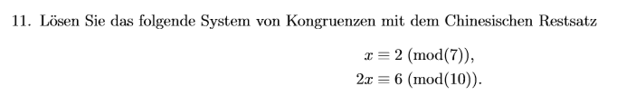

## Aufgabe 11 – Lösung mit dem Chinesischen Restsatz

Gegeben ist das System von Kongruenzen:

    x ≡ 2 mod 7  
    2x ≡ 6 mod 10

---

### Schritt 1: Umformen in die Standardform

Die zweite Kongruenz lautet:

    2x ≡ 6 mod 10

Da der ggT(2, 10) = 2 ist und 6 durch 2 teilbar ist, kürzen wir beidseitig:

    x ≡ 3 mod 5

Jetzt haben wir folgendes System:

    x ≡ 2 mod 7  
    x ≡ 3 mod 5

---

### Schritt 2: Vorbereitung für den Chinesischen Restsatz

#### Gemeinsamer Modul M:

Der Gesamtmodul ist das Produkt der Einzelmoduli:

    M = 7 · 5 = 35

Wir suchen also die Lösung x modulo 35.

#### Teilmoduli:

Die Teilmoduli (M₁, M₂) sind:

    M₁ = M / 7 = 35 / 7 = 5  
    M₂ = M / 5 = 35 / 5 = 7

---

### Schritt 3: Berechnung der modularen Inversen

#### Inverses y₁ ∈ ℤ, sodass:

    M₁ · y₁ ≡ 1 mod 7  
    5 · y₁ ≡ 1 mod 7

Wir verwenden den erweiterten euklidischen Algorithmus:

    7 = 1·5 + 2  
    5 = 2·2 + 1  
    2 = 2·1 + 0

Rückwärts:

    1 = 5 - 2·2  
      = 5 - 2·(7 - 1·5) = 3·5 - 2·7

⇒ 5·3 ≡ 1 mod 7 → y₁ = 3

---

#### Inverses y₂ ∈ ℤ, sodass:

    M₂ · y₂ ≡ 1 mod 5  
    7 · y₂ ≡ 1 mod 5

Erweiterter Algorithmus:

    7 = 1·5 + 2  
    5 = 2·2 + 1  
    2 = 2·1 + 0

Rückwärts:

    1 = 5 - 2·2  
      = 5 - 2·(7 - 1·5) = 3·5 - 2·7

⇒ 7·(−2) ≡ 1 mod 5 → y₂ = −2 ≡ 3 mod 5

---

### Schritt 4: CRT-Formel anwenden

Allgemeine Formel:

    x ≡ a₁·M₁·y₁ + a₂·M₂·y₂ mod M

Setze ein:

    x ≡ 2·5·3 + 3·7·3 = 30 + 63 = 93

Reduziere mod 35:

    93 mod 35 = 93 - 2·35 = 93 - 70 = 23

---

### ✅ Lösung:

    x ≡ 23 mod 35
