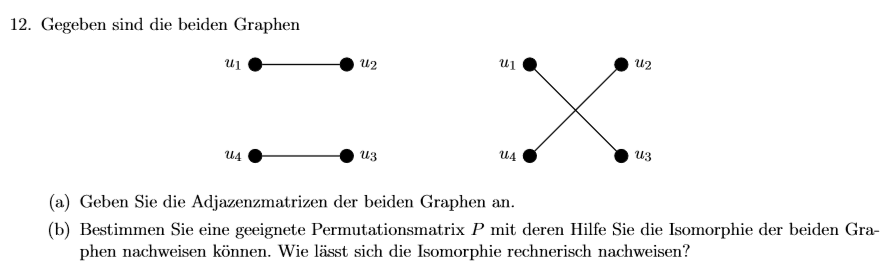

# 🔁 Aufgabe 12 – Graphisomorphie

Gegeben sind zwei ungerichtete Graphen mit den Knoten u₁, u₂, u₃, u₄:

- **Linker Graph:**  
  - Kanten: u₁–u₂, u₃–u₄

- **Rechter Graph:**  
  - Kanten: u₁–u₃, u₂–u₄

---

## (a) Adjazenzmatrizen

**Reihenfolge der Knoten: u₁, u₂, u₃, u₄**

**Linker Graph A₁:**

```

A₁ =
\[ 0 1 0 0 ]
\[ 1 0 0 0 ]
\[ 0 0 0 1 ]
\[ 0 0 1 0 ]

```

**Rechter Graph A₂:**

```

A₂ =
\[ 0 0 1 0 ]
\[ 0 0 0 1 ]
\[ 1 0 0 0 ]
\[ 0 1 0 0 ]

```

---

## (b) Permutationsmatrix und Nachweis

**Idee:**  
Die Graphen sind isomorph, wenn es eine Permutationsmatrix **P** gibt, sodass:

```

A₂ = Pᵗ · A₁ · P

```

### Passende Permutation:

Wir permutieren:  
(u₁, u₂, u₃, u₄) → (u₁, u₃, u₂, u₄)

### Permutationsmatrix P:

```

P =
\[ 1 0 0 0 ]
\[ 0 0 1 0 ]
\[ 0 1 0 0 ]
\[ 0 0 0 1 ]

```

---

### ✅ Isomorphiebeweis:

Berechne:

```

Pᵗ · A₁ · P = A₂

```

Das Ergebnis ist gleich A₂, also sind die beiden Graphen **isomorph**.


