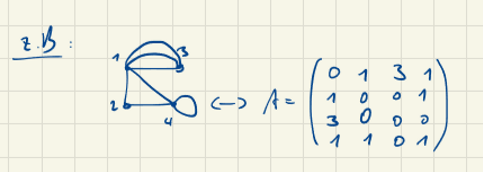

# 🔁 Isomorphie von Graphen & Adjazenzmatrix

## 🔷 Was bedeutet Isomorphie?

Zwei Graphen heißen **isomorph**, wenn sie:
- dieselbe Struktur haben,
- die gleichen Knotenverbindungen besitzen,
- auch wenn die Knoten anders benannt oder anders angeordnet sind.

**Formell:**
Es gibt eine bijektive Abbildung `f: V₁ → V₂`, sodass:

```

{u, v} ∈ E₁  ⇔  {f(u), f(v)} ∈ E₂

```

---

## 🧠 Merkmale isomorpher Graphen:

- gleiche Anzahl von Knoten und Kanten,
- gleiche Knotengradverteilung,
- gleiche Adjazenzstruktur (Verbindungen).

---

## 🧮 Adjazenzmatrix A

Die **Adjazenzmatrix A(G)** für einen Graphen G:
- Zeilen und Spalten = Knoten,
- `A[i][j] = 1` wenn eine Kante von `i` nach `j` existiert.

---

## 🔢 Pfade mit Matrixpotenzen zählen

Wenn `A` die Adjazenzmatrix ist:

- `A¹` zeigt direkte Kanten,
- `A²[i][j]` = Anzahl der Pfade der Länge 2 von `i` nach `j`,
- `Aⁿ[i][j]` = Anzahl der Pfade der Länge `n`.

### Beispiel:

```

A =
    [ 0 1 1 ]
    [ 1 0 1 ]
    [ 1 1 0 ]

A² =
    [ 2 1 1 ]
    [ 1 2 1 ]
    [ 1 1 2 ]

```

---

## 🧩 Isomorphie und Permutationsmatrix

Zwei Graphen `G₁` und `G₂` sind isomorph, wenn man `G₂` durch Umbenennung der Knoten in `G₁` überführen kann.  
Das bedeutet: es gibt eine **Permutationsmatrix P**, sodass:

```

A(G₁) = P × A(G₂) × Pᵀ

```

- `P` vertauscht Zeilen (Knoten umbenennen),
- `Pᵀ` vertauscht Spalten (Verbindungen anpassen).

---

## 🧪 Beispiel: Permutationsmatrix P

Angenommen, die Umbenennung erfolgt so:

```

G₂:
v₁ → u₂
v₂ → u₃
v₃ → u₁

```

Dann ist P wie folgt aufgebaut:

```

P =
    [ 0 1 0 ]  ← u₁ ist jetzt v₂
    [ 0 0 1 ]  ← u₂ ist jetzt v₃
    [ 1 0 0 ]  ← u₃ ist jetzt v₁

```

Dann:

```

A(G₁) = P × A(G₂) × Pᵀ

```

Falls das Ergebnis gleich `A(G₁)` ist, sind `G₁` und `G₂` isomorph.

---

## ✅ Fazit

- Zwei Graphen sind isomorph ⇔ ihre Adjazenzmatrizen lassen sich durch Zeilen-/Spaltenpermutation ineinander überführen.
- Die Permutationsmatrix `P` beschreibt die Umbenennung.

Wenn gilt:

```

A(G₁) = P × A(G₂) × Pᵀ

```

⇒ dann sind `G₁` und `G₂` strukturell identisch.

