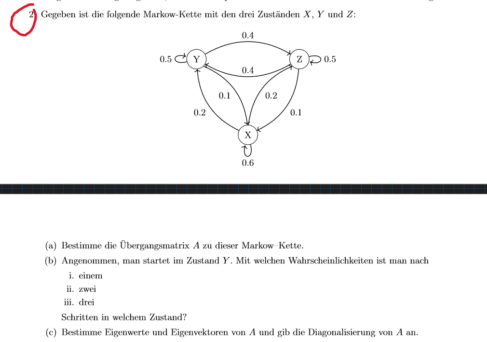
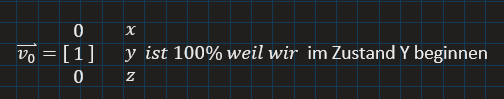
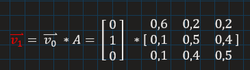
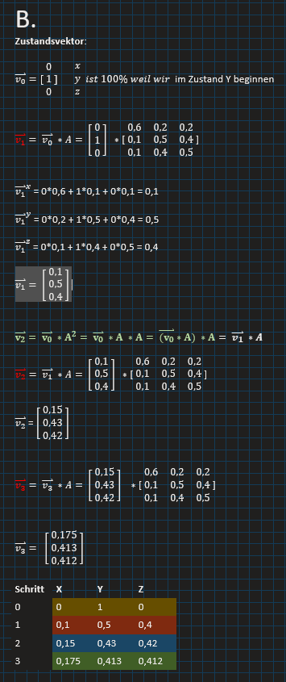
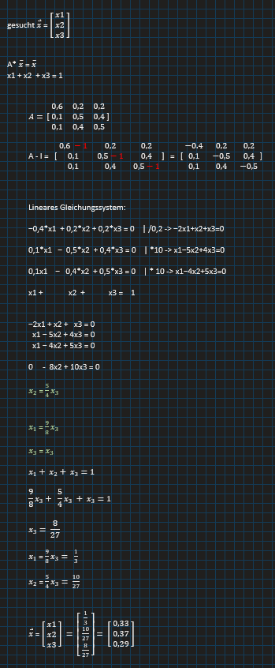
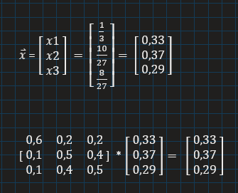

# 🔄 Markow-Kette mit Zuständen X, Y, Z



## 📌 Gegeben:

Eine Markow-Kette mit drei Zuständen (X, Y, Z) und den folgenden Übergangswahrscheinlichkeiten:

### Übergangsmatrix A:

| Von \ Zu |   X   |   Y   |   Z   |
|:--------:|:-----:|:-----:|:-----:|
| **X**    |  0.6  |  0.2  |  0.2  |
| **Y**    |  0.1  |  0.5  |  0.4  |
| **Z**    |  0.1  |  0.4  |  0.5  |

- Zeilen: aktueller Zustand
- Spalten: nächster Zustand
- Eintrag aᵢⱼ = Wahrscheinlichkeit für Übergang von Zustand i nach j

---

## 🔸 a) Übergangsmatrix

Bereits gegeben (siehe oben).

---

## 🔸 b) Zustand nach 1, 2, 3 Schritten bei Start in Zustand Y

### Startvektor:


```

v₀ = [ 0, 1, 0 ]   # 100% im Zustand Y

```

### Schrittweise Berechnung:

**Schritt 1:**

```
v₁ = v₀ × A
= [ 0.1, 0.5, 0.4 ]
```

**Schritt 2:**
```
v₂ = v₁ × A
= [ 0.15, 0.43, 0.42 ]
```

**Schritt 3:**
```
v₃ = v₂ × A
= [ 0.175, 0.413, 0.412 ]
```

### Wahrscheinlichkeitsverteilung:

| Schritt |   X   |   Y   |   Z   |
|:-------:|:-----:|:-----:|:-----:|
|   0     | 0.000 | 1.000 | 0.000 |
|   1     | 0.100 | 0.500 | 0.400 |
|   2     | 0.150 | 0.430 | 0.420 |
|   3     | 0.175 | 0.413 | 0.412 |



## 🔸 c) Stationärer Zustand

Wir suchen den Vektor **x = [x₁, x₂, x₃]**, sodass gilt:

```

A × x = x     und     x₁ + x₂ + x₃ = 1

```

### Gleichungssystem:

```

-0.4 x₁ + 0.2 x₂ + 0.2 x₃ = 0
1.0 x₁ - 5.0 x₂ + 4.0 x₃ = 0
1.0 x₁ - 4.0 x₂ + 5.0 x₃ = 0
x₁ + x₂ + x₃ = 1

```

### Lösung:

```

x₃ = 8 / 27
x₂ = 10 / 27
x₁ = 9 / 27

```

### Gerundeter stationärer Vektor:

```

x = [ 0.33, 0.37, 0.29 ]

```

### Kontrolle:

```

A × x = x

```

✅ Somit ist dies die stationäre Verteilung.

---

## ✅ Zusammenfassung

- Die Übergangsmatrix A bestimmt, wie sich Wahrscheinlichkeiten entwickeln.
- Startend in Y konvergiert die Kette gegen:
```

X: 0.33
Y: 0.37
Z: 0.29

```
- Dies ist der Gleichgewichtszustand (stationärer Zustand), in dem die Wahrscheinlichkeiten konstant bleiben.



