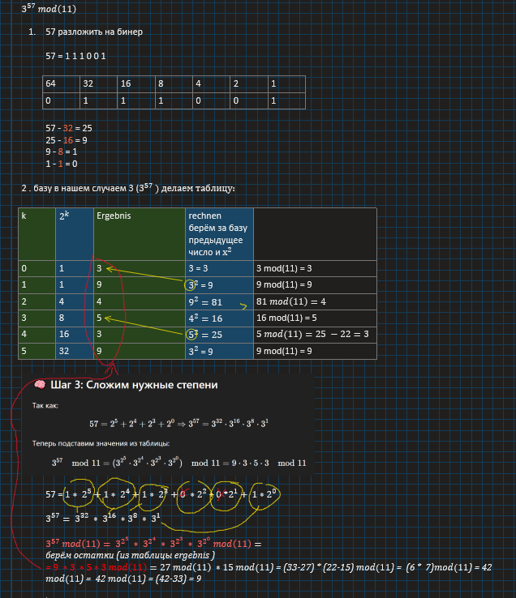

## 🔢 Beispiel: Berechne 3⁵⁷ mod 11

(Mit Binärzerlegung und Modulo-Potenzierung)

---

### 🧮 Schritt 1: Zerlege 57 in Binärform

57 in Binär: `111001`

```
2⁶  2⁵  2⁴  2³  2²  2¹  2⁰  
 0   1   1   1   0   0   1
```

Daher:
57 = 2⁵ + 2⁴ + 2³ + 2⁰

---

### 📊 Schritt 2: Tabelle für Potenzen von 3 mod 11

|  k  |  2ᵏ | 3^(2ᵏ)  | mod 11 |
| :-: | :-: | :------ | :----: |
|  0  |  1  | 3       |    3   |
|  1  |  2  | 3² = 9  |    9   |
|  2  |  4  | 9² = 81 |    4   |
|  3  |  8  | 4² = 16 |    5   |
|  4  |  16 | 5² = 25 |    3   |
|  5  |  32 | 3² = 9  |    9   |

---

### 📌 Schritt 3: Relevante Potenzen auswählen

Da
57 = 2⁵ + 2⁴ + 2³ + 2⁰
⇒ Wir brauchen:
3³², 3¹⁶, 3⁸, 3¹

Aus der Tabelle:

* 3³² mod 11 = 9
* 3¹⁶ mod 11 = 3
* 3⁸  mod 11 = 5
* 3¹  mod 11 = 3

---

### ✴️ Schritt 4: Werte multiplizieren

Berechnung:

```
3⁵⁷ mod 11  
= 3³² × 3¹⁶ × 3⁸ × 3¹ mod 11  
= 9 × 3 × 5 × 3 mod 11  
= 27 × 15 mod 11
```

Jetzt Schritt für Schritt:

* 27 mod 11 = 5
* 15 mod 11 = 4
* 5 × 4 = 20
* 20 mod 11 = **9**

---

## ✅ Ergebnis:

**3⁵⁷ mod 11 = 9**

Funktioniert ✔


