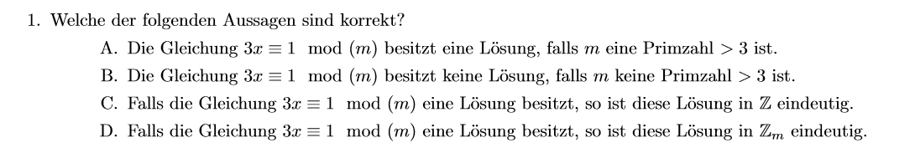

## ✔️ Aufgabe: Welche Aussagen sind korrekt?

Wir betrachten die Kongruenz:

**3x ≡ 1 mod m**

---

## ✅ Lösung:

### A.

**"3x ≡ 1 mod m hat eine Lösung, falls m eine Primzahl > 3 ist."**
✔️ **Richtig.**
Wenn m eine Primzahl > 3 ist, dann gilt:
gcd(3, m) = 1 ⇒ es gibt eine Lösung.

---

### B.

**"3x ≡ 1 mod m hat keine Lösung, falls m keine Primzahl > 3 ist."**
❌ **Falsch.**
Auch wenn m keine Primzahl ist, kann gcd(3, m) = 1 sein.
Beispiel: m = 4 → gcd(3, 4) = 1 → Lösung existiert.

---

### C.

**"Wenn 3x ≡ 1 mod m eine Lösung hat, dann ist diese in ℤ eindeutig."**
❌ **Falsch.**
In ℤ gibt es unendlich viele Lösungen:
x = x₀ + k·m, für jedes ganze k.

---

### D.

**"Wenn 3x ≡ 1 mod m eine Lösung hat, dann ist sie in ℤₘ eindeutig."**
✔️ **Richtig.**
In ℤₘ (Restklassenring) gibt es genau **eine eindeutige Lösung modulo m**, wenn sie existiert.

---

## 🟩 Fazit

| Aussage | Wahr oder falsch |
| ------- | ---------------- |
| A       | ✅ Wahr           |
| B       | ❌ Falsch         |
| C       | ❌ Falsch         |
| D       | ✅ Wahr           |

