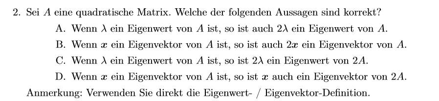

# 📘 Beispiel: Eigenwerte und Eigenvektoren – Prüfung von Aussagen

## 🔢 Gegeben sei die Matrix

A =  
[ 2  0 ]  
[ 0  3 ]

---

## 🎯 Eigenwerte und Eigenvektoren von A

**Eigenwerte:**

- λ₁ = 2  
- λ₂ = 3

**Eigenvektoren:**

- Zu λ = 2:  
  **x₁** =  
  [ 1 ]  
  [ 0 ]

- Zu λ = 3:  
  **x₂** =  
  [ 0 ]  
  [ 1 ]

---

## ✅ Prüfung der Aussagen

| Aussage | Wahr? | Begründung |
|--------|-------|------------|
| **A.** 2·λ ist Eigenwert von A? | ❌ Nein | Eigenwerte skalieren sich nicht automatisch |
| **B.** 2·x ist Eigenvektor von A? | ✅ Ja | Eigenvektoren dürfen skaliert werden |
| **C.** 2·λ ist Eigenwert von 2A? | ✅ Ja | \( 2A·x = 2λ·x \) |
| **D.** x bleibt Eigenvektor von 2A? | ✅ Ja | Nur der Eigenwert ändert sich |

---

## 📌 Matrix 2A

2A =  
[ 4  0 ]  
[ 0  6 ]

**Neue Eigenwerte:**  
- λ₁ = 4  
- λ₂ = 6

